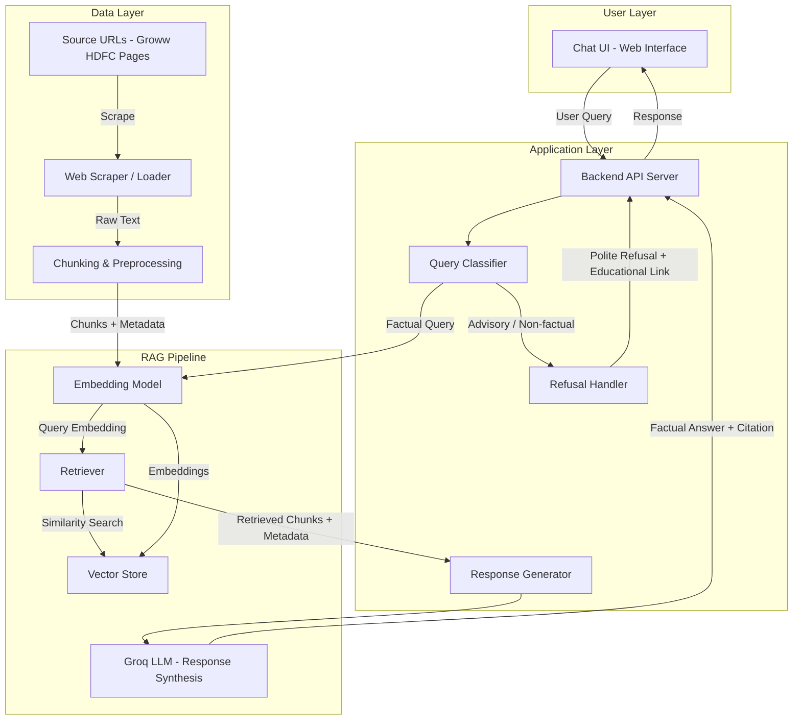
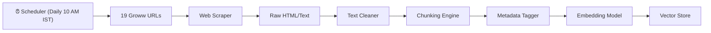
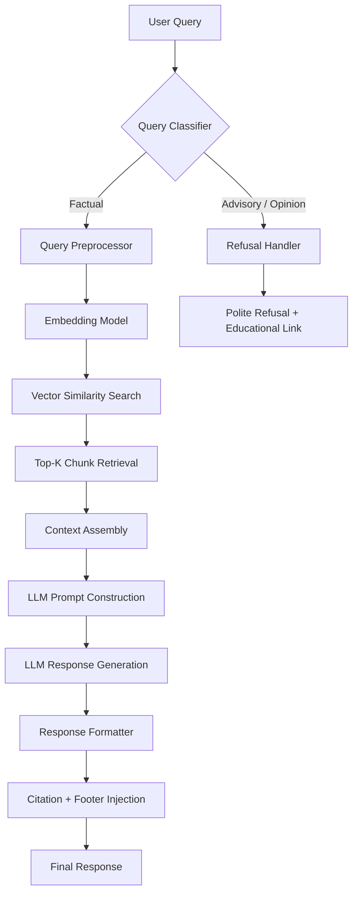
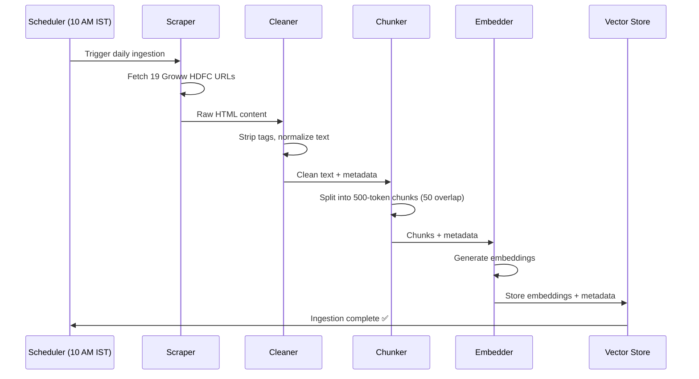
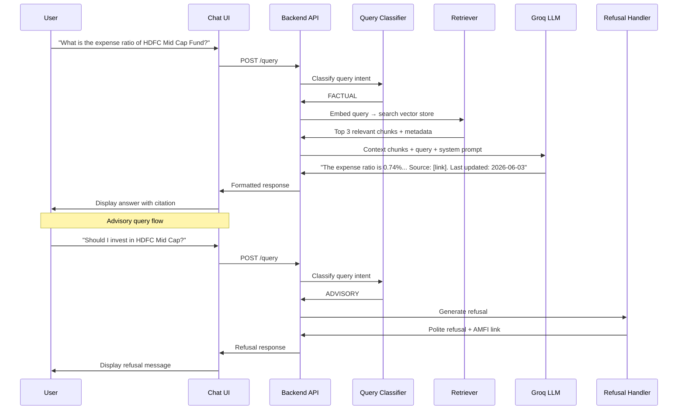

# Architecture: Mutual Fund FAQ Assistant

## 1. System Overview

The Mutual Fund FAQ Assistant is a lightweight **Retrieval-Augmented Generation (RAG)** system designed to answer facts-only queries about HDFC mutual fund schemes. It retrieves verified information from a curated corpus of 19 official Groww scheme pages and generates concise, source-backed responses — without offering any investment advice.



---

## 2. Component Architecture

### 2.1 Data Ingestion Pipeline

Responsible for scraping, processing, and indexing the mutual fund corpus. A **daily scheduler** triggers this pipeline automatically at **10:00 AM IST** to keep the corpus fresh.



| Component | Purpose | Recommended Tool |
|---|---|---|
| **Scheduler** | Trigger ingestion pipeline daily at 10:00 AM IST | `APScheduler` or `cron` |
| **Web Scraper** | Fetch page content from Groww scheme URLs | `BeautifulSoup` + `requests` or `Playwright` |
| **Text Cleaner** | Strip HTML tags, headers, footers, ads; normalize whitespace | Custom Python module |
| **Chunking Engine** | Split cleaned text into overlapping semantic chunks | `LangChain RecursiveCharacterTextSplitter` |
| **Metadata Tagger** | Attach source URL, scheme name, scrape date to each chunk | Custom Python module |
| **Embedding Model** | Generate vector embeddings for each chunk | `BAAI/bge-small-en-v1.5` |
| **Vector Store** | Store and index embeddings for similarity search | `ChromaDB` (local) or `FAISS` |

#### Chunking Strategy

| Parameter | Value | Rationale |
|---|---|---|
| Chunk Size | 500 tokens | Balances context completeness and retrieval precision |
| Chunk Overlap | 50 tokens | Prevents information loss at chunk boundaries |
| Separator Hierarchy | `\n\n` → `\n` → `. ` → ` ` | Respects natural document structure |

#### Metadata Schema (Per Chunk)

```json
{
  "chunk_id": "hdfc-mid-cap-fund-003",
  "scheme_name": "HDFC Mid Cap Fund Direct Growth",
  "source_url": "https://groww.in/mutual-funds/hdfc-mid-cap-fund-direct-growth",
  "scrape_date": "2026-06-03",
  "section": "expense_ratio",
  "chunk_index": 3,
  "total_chunks": 12
}
```

---

### 2.2 Query Processing Pipeline

Handles incoming user queries — classifying, retrieving, and generating responses.



---

### 2.3 Query Classifier

Determines whether a query is factual (allowed) or advisory/opinion-based (refused).

#### Classification Strategy

| Approach | Details |
|---|---|
| **Primary** | Keyword + intent pattern matching (fast, rule-based) |
| **Fallback** | LLM-based zero-shot classification |

#### Factual Query Patterns (Allowed)

| Category | Example Queries |
|---|---|
| Expense Ratio | "What is the expense ratio of HDFC Mid Cap Fund?" |
| Exit Load | "What is the exit load for HDFC Small Cap Fund?" |
| Minimum SIP | "What is the minimum SIP amount for HDFC Equity Fund?" |
| Lock-in Period | "What is the lock-in period for HDFC ELSS fund?" |
| Riskometer | "What is the risk category of HDFC Balanced Advantage Fund?" |
| Benchmark | "What is the benchmark index for HDFC Nifty 50 Index Fund?" |
| Fund Management | "Who is the fund manager of HDFC Mid Cap Fund?" |
| Statements/Tax | "How do I download my capital gains report from Groww?" |

#### Advisory Query Patterns (Refused)

| Pattern | Example |
|---|---|
| Recommendation | "Should I invest in HDFC Mid Cap Fund?" |
| Comparison | "Which is better — HDFC Mid Cap or Small Cap?" |
| Prediction | "Will HDFC Equity Fund give good returns?" |
| Performance Judgment | "Is HDFC Defence Fund a good investment?" |

---

### 2.4 Refusal Handler

Generates polite, structured refusal messages for non-factual queries.

#### Refusal Response Template

```
I can only provide factual information about mutual fund schemes.
I'm unable to offer investment advice or recommendations.

For guidance on investing, you may refer to:
🔗 https://www.amfiindia.com/investor-corner/knowledge-center
```

---

### 2.5 Response Generator (LLM)

Synthesizes final answers using retrieved context chunks and a carefully crafted prompt.

#### System Prompt

```
You are a facts-only mutual fund FAQ assistant for HDFC mutual fund schemes 
listed on Groww. You MUST follow these rules strictly:

1. Answer ONLY using information found in the provided context chunks.
2. Keep responses to a MAXIMUM of 3 sentences.
3. Include EXACTLY ONE citation link (the source URL from the chunk metadata).
4. Append a footer: "Last updated from sources: <scrape_date>"
5. NEVER provide investment advice, opinions, or recommendations.
6. NEVER compare fund performance or calculate returns.
7. If the answer is not found in the context, say: 
   "I don't have this information in my current sources."
8. Include fund management data (fund manager name, tenure) when asked.
```

#### LLM Configuration

| Parameter | Value | Rationale |
|---|---|---|
| Provider | **Groq** | Ultra-low latency inference (LPU hardware) |
| Model | `llama-3.3-70b-versatile` or `llama-3.1-8b-instant` | Open-source, fast, sufficient for extraction tasks |
| Temperature | `0.0` | Deterministic, factual responses — no creativity needed |
| Max Tokens | `200` | Enforces concise 3-sentence answers |
| Top-K Retrieval | `3–5 chunks` | Provides enough context without noise |

---

## 3. Tech Stack

| Layer | Technology | Purpose |
|---|---|---|
| **Frontend** | HTML + CSS + JavaScript | Minimal chat UI |
| **Backend** | Python (FastAPI) | API server, query orchestration |
| **Scheduler** | `APScheduler` or system `cron` | Daily 10 AM IST ingestion trigger |
| **Embedding** | `sentence-transformers` | Text → vector conversion |
| **Vector Store** | ChromaDB or FAISS | Similarity search and chunk retrieval |
| **LLM** | **Groq** (Llama 3.3 70B / Llama 3.1 8B) | Ultra-fast response generation via Groq LPU |
| **Scraping** | BeautifulSoup + requests | Data ingestion from Groww URLs |
| **Orchestration** | LangChain | RAG pipeline wiring |

---

## 4. Project Directory Structure

```
Groww_Milestone/
├── docs/
│   └── problemSTatement.txt        # Original problem statement
├── problemStatement.md             # Formatted problem statement
├── architecture.md                 # This file
│
├── src/
│   ├── ingestion/
│   │   ├── scraper.py              # Web scraper for Groww URLs
│   │   ├── cleaner.py              # HTML/text cleaning utilities
│   │   ├── chunker.py              # Text chunking logic
│   │   ├── embedder.py             # Embedding generation + vector store indexing
│   │   └── scheduler.py            # Daily 10 AM IST cron scheduler
│   │
│   ├── retrieval/
│   │   ├── retriever.py            # Vector similarity search
│   │   └── context_builder.py      # Assemble retrieved chunks into LLM context
│   │
│   ├── classification/
│   │   ├── query_classifier.py     # Factual vs advisory classification
│   │   └── refusal_handler.py      # Refusal response generation
│   │
│   ├── generation/
│   │   ├── prompt_builder.py       # LLM prompt construction
│   │   ├── llm_client.py           # LLM API wrapper
│   │   └── response_formatter.py   # Citation + footer injection
│   │
│   ├── api/
│   │   ├── main.py                 # FastAPI app entry point
│   │   └── routes.py               # API route definitions
│   │
│   └── config/
│       ├── settings.py             # App configuration
│       └── urls.py                 # Source URL registry
│
├── frontend/
│   ├── index.html                  # Chat UI
│   ├── index.css                   # Styles
│   └── app.js                      # Frontend logic
│
├── data/
│   ├── raw/                        # Raw scraped data
│   ├── processed/                  # Cleaned and chunked data
│   └── vectorstore/                # ChromaDB / FAISS index files
│
├── tests/
│   ├── test_classifier.py          # Query classification tests
│   ├── test_retriever.py           # Retrieval accuracy tests
│   └── test_refusal.py             # Refusal handling tests
│
├── requirements.txt                # Python dependencies
├── .env.example                    # Environment variable template
└── README.md                       # Setup and usage guide
```

---

## 5. Data Flow (End-to-End)

### 5.1 Ingestion Flow (Scheduled — Daily at 10:00 AM IST)



### 5.2 Query Flow (Online / Real-Time)



---

## 6. API Design

### 6.1 Endpoints

| Method | Endpoint | Description |
|---|---|---|
| `POST` | `/api/query` | Submit a user query and get a response |
| `GET` | `/api/health` | Health check |
| `GET` | `/api/schemes` | List all indexed schemes |

### 6.2 Request / Response Schemas

#### `POST /api/query`

**Request:**
```json
{
  "query": "What is the expense ratio of HDFC Mid Cap Fund?"
}
```

**Response (Factual):**
```json
{
  "status": "success",
  "type": "factual",
  "answer": "The expense ratio of HDFC Mid Cap Fund Direct Growth is 0.74% (as of the latest factsheet).",
  "citation": "https://groww.in/mutual-funds/hdfc-mid-cap-fund-direct-growth",
  "last_updated": "2026-06-03"
}
```

**Response (Refusal):**
```json
{
  "status": "success",
  "type": "refusal",
  "answer": "I can only provide factual information about mutual fund schemes. I'm unable to offer investment advice or recommendations.",
  "educational_link": "https://www.amfiindia.com/investor-corner/knowledge-center",
  "last_updated": null
}
```

---

## 7. Security & Privacy Guardrails

| Guardrail | Implementation |
|---|---|
| **No PII Collection** | No input fields for PAN, Aadhaar, account numbers, OTPs, email, or phone |
| **Input Sanitization** | Strip and reject inputs containing PII patterns (regex-based) |
| **No Data Persistence** | User queries are not stored beyond the session |
| **Content Filtering** | Query classifier blocks advisory, comparative, and speculative queries |
| **Source Restriction** | Only official Groww/AMC/AMFI/SEBI URLs are used — no third-party sources |

---

## 8. Frontend (Chat UI)

### Layout

```
┌─────────────────────────────────────────────┐
│  🏦 Mutual Fund FAQ Assistant               │
│  ━━━━━━━━━━━━━━━━━━━━━━━━━━━━━━━━━━━━━━━━  │
│  ⚠️ Facts-only. No investment advice.        │
│                                             │
│  Welcome! Ask me factual questions about    │
│  HDFC mutual fund schemes. Try:             │
│                                             │
│  💡 "What is the expense ratio of HDFC      │
│      Mid Cap Fund?"                         │
│  💡 "What is the exit load for HDFC Small   │
│      Cap Fund?"                             │
│  💡 "Who is the fund manager of HDFC        │
│      Equity Fund?"                          │
│                                             │
│  ┌─────────────────────────────────────┐    │
│  │ User: What is the minimum SIP for   │    │
│  │       HDFC Nifty 50 Index Fund?     │    │
│  └─────────────────────────────────────┘    │
│  ┌─────────────────────────────────────┐    │
│  │ Bot: The minimum SIP amount for     │    │
│  │ HDFC Nifty 50 Index Fund Direct     │    │
│  │ Growth is ₹100.                     │    │
│  │ 🔗 Source                           │    │
│  │ Last updated from sources: June 3   │    │
│  └─────────────────────────────────────┘    │
│                                             │
│  ┌───────────────────────────────┐ [Send]   │
│  │ Type your question...         │          │
│  └───────────────────────────────┘          │
└─────────────────────────────────────────────┘
```

---

## 9. Testing Strategy

| Test Type | Scope | Tools |
|---|---|---|
| **Unit Tests** | Query classifier, chunker, refusal handler | `pytest` |
| **Integration Tests** | End-to-end RAG pipeline (query → response) | `pytest` + mock LLM |
| **Retrieval Accuracy** | Verify correct chunks retrieved for known queries | Manual + automated |
| **Refusal Coverage** | Ensure advisory queries are consistently refused | Curated test set |
| **Citation Validation** | Verify every response has exactly one valid source link | Automated checks |

---

## 10. Known Limitations

| Limitation | Mitigation |
|---|---|
| Data goes stale as Groww pages update | Automated daily re-scraping via scheduler at 10:00 AM IST |
| Limited to 19 HDFC schemes | Extensible — add more URLs to the registry |
| Single AMC coverage (HDFC only) | Architecture supports multi-AMC expansion |
| No real-time NAV or return data | Out of scope; link to official factsheet instead |
| Dependent on Groww page structure | Scraper may break if Groww redesigns — monitor and adapt |
| 3-sentence limit may truncate complex answers | Acceptable trade-off for clarity and compliance |
