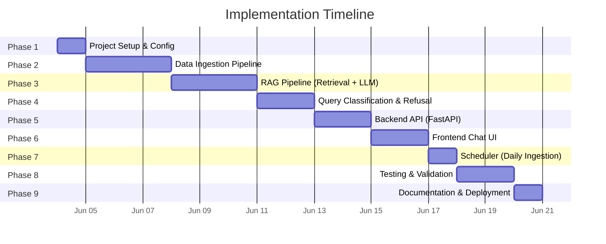
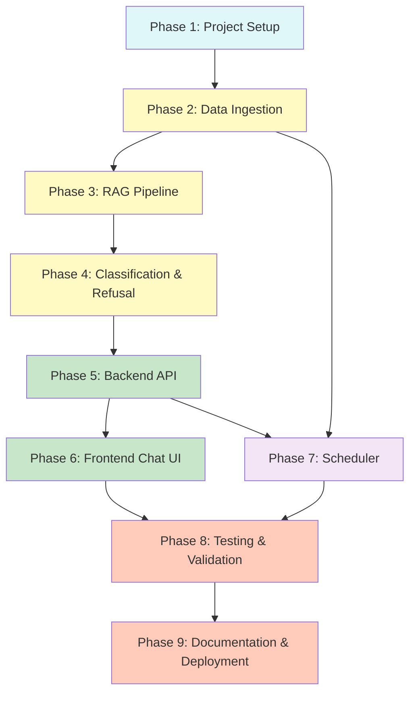

# Implementation Plan: Mutual Fund FAQ Assistant

A phase-wise plan for building the RAG-based Mutual Fund FAQ Assistant, derived from the [problemStatement.md](file:///Users/shreyash/NextLeap/Groww_Milestone/problemStatement.md) and [architecture.md](file:///Users/shreyash/NextLeap/Groww_Milestone/architecture.md).

---

## Phase Overview



| Phase | Name | Duration | Key Deliverables |
|---|---|---|---|
| 1 | Project Setup & Configuration | 1 day | Directory structure, dependencies, environment config |
| 2 | Data Ingestion Pipeline | 3 days | Scraper, cleaner, chunker, embedder, vector store |
| 3 | RAG Pipeline | 3 days | Retriever, context builder, Groq LLM integration, response formatter |
| 4 | Query Classification & Refusal | 2 days | Query classifier, refusal handler |
| 5 | Backend API | 2 days | FastAPI server, API routes, request orchestration |
| 6 | Frontend Chat UI | 2 days | Chat interface with welcome message, examples, disclaimer |
| 7 | Scheduler | 1 day | Daily 10 AM IST automated ingestion |
| 8 | Testing & Validation | 2 days | Unit tests, integration tests, retrieval accuracy tests |
| 9 | Documentation & Deployment | 1 day | README, walkthrough, deployment guide |

**Total Estimated Duration: ~17 days**

---

## Phase 1: Project Setup & Configuration

### Objective
Set up the project directory structure, install dependencies, and configure environment variables.

### Tasks

- [x] Initialize the project directory structure:
  ```
  Groww_Milestone/
  ├── src/
  │   ├── ingestion/
  │   ├── retrieval/
  │   ├── classification/
  │   ├── generation/
  │   ├── api/
  │   └── config/
  ├── frontend/
  ├── data/
  │   ├── raw/
  │   ├── processed/
  │   └── vectorstore/
  └── tests/
  ```
- [x] Create `requirements.txt` with all dependencies:
  ```
  fastapi
  uvicorn
  requests
  beautifulsoup4
  langchain
  langchain-community
  sentence-transformers
  chromadb
  groq
  apscheduler
  python-dotenv
  pytest
  ```
- [x] Create `.env.example` with required environment variables:
  ```
  GROQ_API_KEY=your_groq_api_key_here
  EMBEDDING_MODEL=BAAI/bge-small-en-v1.5
  LLM_MODEL=llama-3.3-70b-versatile
  LLM_TEMPERATURE=0.0
  LLM_MAX_TOKENS=200
  CHROMA_PERSIST_DIR=./data/vectorstore
  SCHEDULER_HOUR=10
  SCHEDULER_MINUTE=0
  ```
- [x] Create `src/config/settings.py` — centralized configuration loader
- [x] Create `src/config/urls.py` — URL registry with all 19 HDFC scheme URLs

### Acceptance Criteria
- All directories exist
- `pip install -r requirements.txt` succeeds
- Config loads environment variables correctly

---

## Phase 2: Data Ingestion Pipeline

### Objective
Build the pipeline to scrape, clean, chunk, and embed mutual fund data from 19 Groww URLs into a vector store.

### Tasks

#### 2.1 Web Scraper (`src/ingestion/scraper.py`)
- [x] Implement `scrape_url(url: str) -> dict` that fetches page content
- [x] Use `requests` + `BeautifulSoup` for HTML parsing
- [x] Extract key sections: scheme name, expense ratio, exit load, SIP details, riskometer, benchmark, fund manager, lock-in period
- [x] Return structured data with source URL and scrape timestamp
- [x] Handle HTTP errors, timeouts, and rate limiting gracefully

#### 2.2 Text Cleaner (`src/ingestion/cleaner.py`)
- [x] Implement `clean_text(raw_html: str) -> str`
- [x] Strip HTML tags, navigation elements, footers, and ads
- [x] Normalize whitespace and special characters
- [x] Remove duplicate content blocks

#### 2.3 Chunking Engine (`src/ingestion/chunker.py`)
- [x] Implement a custom **Structural/Semantic Chunker** rather than a naive text splitter.
- [x] Parse the structured text file and split it into logical blocks:
  - **Chunk 1: Key Metrics & Overview** (Lines 1-10: NAV, AUM, Risk, Expense Ratio, etc.)
  - **Chunk 2: Investment Objective** (The objective paragraph)
  - **Chunk 3: Exit Load & Tax Implications** (Exit load and taxation rules)
  - **Chunk 4...N: Fund Managers** (One separate chunk for each fund manager)
- [x] Attach rich metadata to each chunk, ensuring the scheme context is preserved:
  ```json
  {
    "chunk_id": "hdfc-mid-cap-fund-manager-1",
    "scheme_name": "HDFC Mid Cap Fund Direct Growth",
    "source_url": "https://groww.in/mutual-funds/...",
    "scrape_date": "2026-06-03",
    "section": "fund_managers",
    "chunk_index": 4,
    "total_chunks": 5
  }
  ```

#### 2.4 Embedding & Indexing (`src/ingestion/embedder.py`)
- [x] Load `BAAI/bge-small-en-v1.5` model
- [x] Generate embeddings for all chunks
- [x] Store embeddings + metadata in **ChromaDB** (persisted to `data/vectorstore/`)
- [x] Implement `rebuild_index()` — clears old data and re-indexes fresh content

#### 2.5 Ingestion Orchestrator (`src/ingestion/__init__.py`)
- [x] Create `run_ingestion()` function that orchestrates the full pipeline:
  1. Scrape all 19 URLs
  2. Clean raw content
  3. Chunk text
  4. Generate embeddings
  5. Store in vector store
- [x] Add logging for each stage (URLs processed, chunks created, errors)

### Acceptance Criteria
- Successfully scrapes all 19 Groww URLs
- Generates clean, well-structured chunks with metadata
- ChromaDB vector store is populated and queryable
- `run_ingestion()` completes end-to-end without errors

---

## Phase 3: RAG Pipeline (Retrieval + LLM)

### Objective
Build the retrieval and generation components that find relevant chunks and produce source-backed answers via Groq.

### Tasks

#### 3.1 Retriever (`src/retrieval/retriever.py`)

##### Corpus Characteristics (Informing Strategy)
- **102 total chunks** across 19 HDFC fund schemes (~5.4 chunks/fund)
- 4 section types: Key Metrics & Overview (19), Investment Objective (19), Exit Load & Tax Implications (19), Fund Managers (45 — one per manager)
- Chunk sizes range from ~92 chars (short objectives) to ~2,219 chars (fund managers with long "Other Schemes Managed" lists)
- Every chunk carries rich metadata: `scheme_name`, `source_url`, `scrape_date`, `section`, `chunk_id`, `chunk_index`, `total_chunks`

##### Strategy: Direct Similarity Search with Score Filtering
- **Single-stage vector search** using `similarity_search_with_relevance_scores` via the existing LangChain `Chroma` wrapper
- **No re-ranker** — 102 chunks is too small for a re-ranker to add value; it only adds latency and a dependency
- **No hybrid search (BM25 + vector)** — the BGE embedding model handles keyword-heavy queries (e.g., "expense ratio") well enough at this corpus scale
- **No metadata pre-filtering** — pre-filtering by `scheme_name` would require fund-name extraction before retrieval, adding an NLP step. Semantic search naturally resolves the right scheme because fund names appear in `page_content`
- **Reuse `get_vectorstore()`** from `src/ingestion/embedder.py` to ensure the same embedding model, collection, and persistence directory are used

##### Tasks
- [x] Implement `retrieve(query: str, top_k: int = 5) -> list[dict]`
- [x] Reuse `get_vectorstore()` from `src/ingestion/embedder.py` (same BGE model + ChromaDB collection)
- [x] Embed user query and perform cosine similarity search against ChromaDB
- [x] Apply relevance score threshold (`SIMILARITY_THRESHOLD = 0.3` from `settings.py`) to filter low-quality matches
- [x] Return top-K chunks with metadata (source URL, scheme name, scrape date) and `relevance_score`
- [x] Handle edge cases:
  - Empty vector store → return empty list + log warning
  - Long queries (>500 words) → truncate to first 200 tokens before embedding
  - All scores below threshold → return empty list (caller returns "I don't have this information")

##### Parameters

| Parameter | Value | Rationale |
|---|---|---|
| `top_k` | **5** (default, configurable via `TOP_K_RESULTS` env var) | A typical fund has 5–6 chunks. Top-5 ensures metrics + objective + exit-load chunks can all be retrieved for broad queries. Threshold filter prunes irrelevant results regardless. |
| `similarity_threshold` | **0.3** (configurable via `SIMILARITY_THRESHOLD` env var) | With normalized BGE embeddings, cosine similarity < 0.3 indicates poor semantic match. |
| Distance metric | Cosine similarity | BGE embeddings are normalized (`normalize_embeddings=True`), making cosine the natural choice. |

##### Return Format
Each result is a dictionary:
```json
{
  "page_content": "...",
  "metadata": {
    "scheme_name": "HDFC Mid Cap Fund Direct Growth",
    "source_url": "https://groww.in/mutual-funds/hdfc-mid-cap-fund-direct-growth",
    "scrape_date": "2026-06-03",
    "section": "Key Metrics & Overview",
    "chunk_id": "hdfc-mid-cap-fund-direct-growth-metrics",
    "chunk_index": 1,
    "total_chunks": 5
  },
  "relevance_score": 0.82
}
```

#### 3.2 Context Builder (`src/retrieval/context_builder.py`)
- [x] Implement `build_context(chunks: list[dict]) -> str`
- [x] Assemble retrieved chunks into a structured context string for the LLM
- [x] Include metadata (source URL, scheme name) in the context block
- [x] De-duplicate overlapping chunk content

#### 3.3 Groq LLM Client (`src/generation/llm_client.py`)
- [x] Implement `GroqClient` class wrapping the Groq API
- [x] Configure:
  - Model: `llama-3.3-70b-versatile` (primary) / `llama-3.1-8b-instant` (fallback)
  - Temperature: `0.0`
  - Max tokens: `200`
- [x] Implement `generate(system_prompt: str, user_prompt: str) -> str`
- [x] Handle API rate limits and errors with retry logic

#### 3.4 Prompt Builder (`src/generation/prompt_builder.py`)
- [x] Implement system prompt:
  ```
  You are a facts-only mutual fund FAQ assistant for HDFC mutual fund schemes
  listed on Groww. You MUST follow these rules strictly:

  1. Answer ONLY using information found in the provided context chunks.
  2. Keep responses to a MAXIMUM of 3 sentences.
  3. Include EXACTLY ONE citation link (the source URL from the chunk metadata).
  4. Append a footer: "Last updated from sources: <scrape_date>"
  5. NEVER provide investment advice, opinions, or recommendations.
  6. NEVER compare fund performance or calculate returns.
  7. If the answer is not found in the context, say:
     "I don't have this information in my current sources."
  8. Include fund management data (fund manager name, tenure) when asked.
  ```
- [x] Implement `build_prompt(query: str, context: str) -> tuple[str, str]`
- [x] Return system prompt and user prompt with context injected

#### 3.5 Response Formatter (`src/generation/response_formatter.py`)
- [x] Implement `format_response(raw_answer: str, metadata: dict) -> dict`
- [x] Ensure response includes:
  - Answer text (max 3 sentences)
  - Exactly one citation link
  - Footer: `"Last updated from sources: <date>"`
- [x] Parse and validate the LLM output structure

### Acceptance Criteria
- Retriever returns relevant chunks for test queries
- Groq LLM generates accurate, concise, source-backed answers
- Responses consistently follow the 3-sentence + 1-citation format
- End-to-end: query → retrieval → generation → formatted response works

---

## Phase 4: Query Classification & Refusal Handling

### Objective
Build the query classifier that distinguishes factual queries from advisory/opinion queries, and the refusal handler for non-factual queries.

### Tasks

#### 4.1 Query Classifier (`src/classification/query_classifier.py`)
- [x] Implement `classify(query: str) -> str` returning `"factual"` or `"advisory"`
- [x] **Primary approach** — Rule-based keyword + intent pattern matching:
  - Advisory patterns: "should I", "which is better", "recommend", "good investment", "will it give", "invest in"
  - Factual patterns: "what is", "expense ratio", "exit load", "SIP amount", "fund manager", "lock-in", "benchmark", "riskometer"
- [x] **Fallback** — Groq LLM zero-shot classification for ambiguous queries
- [x] Handle edge cases (e.g., "Is the expense ratio of HDFC Mid Cap Fund high?" → factual, not advisory)

#### 4.2 Refusal Handler (`src/classification/refusal_handler.py`)
- [x] Implement `generate_refusal(query: str) -> dict`
- [x] Return polite refusal with:
  - Clear message reinforcing facts-only limitation
  - Relevant educational link (AMFI/SEBI)
- [x] Refusal response template:
  ```json
  {
    "status": "success",
    "type": "refusal",
    "answer": "I can only provide factual information about mutual fund schemes. I'm unable to offer investment advice or recommendations.",
    "educational_link": "https://www.amfiindia.com/investor-corner/knowledge-center",
    "last_updated": null
  }
  ```

#### 4.3 PII Detection (`src/classification/query_classifier.py`)
- [x] Add regex patterns to detect and reject PII inputs:
  - PAN numbers (format: `ABCDE1234F`)
  - Aadhaar numbers (12 digits)
  - Phone numbers (10 digits)
  - Email addresses
- [x] Return a privacy-focused refusal if PII is detected

### Acceptance Criteria
- Correctly classifies at least 95% of test queries
- Advisory queries consistently receive polite refusals
- PII inputs are blocked with appropriate messages
- Edge cases handled without false positives on factual queries

---

## Phase 5: Backend API (FastAPI)

### Objective
Build the FastAPI server that orchestrates query processing and exposes REST endpoints.

### Tasks

#### 5.1 FastAPI App (`src/api/main.py`)
- [x] Initialize FastAPI application with CORS middleware
- [x] Configure static file serving for frontend
- [x] Add startup event to load the vector store and embedding model
- [x] Add exception handlers for graceful error responses

#### 5.2 API Routes (`src/api/routes.py`)
- [x] Implement `POST /api/query`:
  1. Receive user query
  2. Run through query classifier
  3. If advisory → return refusal response
  4. If factual → retrieve chunks → generate response via Groq → format and return
- [x] Implement `GET /api/health`:
  - Return system status, vector store size, last ingestion date
- [x] Implement `GET /api/schemes`:
  - Return list of all 19 indexed HDFC scheme names and URLs

#### 5.3 Request/Response Models
- [x] Define Pydantic models:
  ```python
  class QueryRequest(BaseModel):
      query: str

  class QueryResponse(BaseModel):
      status: str
      type: str  # "factual" or "refusal"
      answer: str
      citation: Optional[str]
      educational_link: Optional[str]
      last_updated: Optional[str]
  ```

#### 5.4 Query Orchestration Pipeline
- [x] Wire together all components in the correct order:
  ```
  Query → PII Check → Classify → [Retrieve → Build Context → LLM → Format] or [Refuse]
  ```
- [x] Add request logging (query received, classification result, response time)

### Acceptance Criteria
- API starts successfully on `http://localhost:8000`
- `POST /api/query` returns correct responses for factual and advisory queries
- `GET /api/health` returns system status
- `GET /api/schemes` returns all 19 schemes
- CORS configured for frontend communication

---

## Phase 6: Frontend Chat UI

### Objective
Build a minimal, clean chat interface with welcome message, example questions, and disclaimer.

### Tasks

#### 6.1 UI Structure (Next.js & React)
- [x] Create layout with Sidebar and Main Chat Area:
  - Sidebar: "New Analysis" button, list of Supported Schemes, and "About" button
  - Header: Logo and Title ("WealthFact")
  - Disclaimer banner: "⚠️ Facts-only. No investment advice."
  - Welcome message area with example questions
  - Chat message area (scrollable)
  - Input field + send button
- [x] Create `About.tsx` page outlining platform capabilities and limitations

#### 6.2 Styling (Tailwind CSS)
- [x] Clean, minimal glassmorphism design
- [x] Distinct styling for user messages vs bot messages
- [x] Styled citation links and "Last updated" footer in bot responses
- [x] Distinct styling for refusal messages
- [x] Responsive layout for mobile and desktop
- [x] Loading indicator while waiting for API response

#### 6.3 Frontend Logic (`frontend/app.js`)
- [x] Implement `sendQuery(query)` — POST to `/api/query`
- [x] Render bot responses with:
  - Answer text
  - Clickable citation link
  - "Last updated" footer
- [x] Render refusal responses with educational link
- [x] Handle example question clicks — auto-send as query
- [ ] Handle loading state (disable input, show spinner)
- [ ] Handle API errors gracefully with user-friendly messages
- [ ] Auto-scroll to latest message

### Acceptance Criteria
- Welcome message and 3 example questions are visible on load
- Disclaimer is prominently displayed
- User can type and send queries
- Bot responses display with citation and footer
- Refusal messages display with educational link
- Responsive on mobile and desktop

---

## Phase 7: Scheduler (Daily Ingestion)

### Objective
Set up automated daily re-ingestion of all 19 URLs at 10:00 AM IST.

### Tasks

#### 7.1 Scheduler Setup (`src/ingestion/scheduler.py`)
- [x] Implement scheduler using `APScheduler`:
  ```python
  from apscheduler.schedulers.background import BackgroundScheduler
  from apscheduler.triggers.cron import CronTrigger

  scheduler = BackgroundScheduler()
  scheduler.add_job(
      run_ingestion,
      trigger=CronTrigger(hour=10, minute=0, timezone="Asia/Kolkata"),
      id="daily_ingestion",
      name="Daily corpus re-ingestion"
  )
  ```
- [x] Integrate scheduler startup with FastAPI lifespan events
- [x] Add logging for scheduler triggers and completion status
- [x] Handle ingestion failures gracefully (retain previous data if new scrape fails)

#### 7.2 Manual Trigger Endpoint
- [x] Add `POST /api/ingest` endpoint for manual ingestion trigger (admin use)
- [x] Return ingestion status and stats (URLs scraped, chunks created, time taken)

### Acceptance Criteria
- Scheduler starts automatically with the FastAPI app
- Ingestion triggers daily at 10:00 AM IST
- Manual trigger works via API
- Previous data is preserved if a re-ingestion fails
- Logs confirm scheduled runs

---

## Phase 8: Testing & Validation

### Objective
Validate all components through unit tests, integration tests, and end-to-end testing.

### Tasks

#### 8.1 Unit Tests

| Test File | Scope |
|---|---|
| `tests/test_scraper.py` | Scraper fetches and parses Groww pages correctly |
| `tests/test_cleaner.py` | Text cleaning removes HTML artifacts |
| `tests/test_chunker.py` | Chunks are correctly sized with proper overlap and metadata |
| `tests/test_classifier.py` | Factual vs advisory classification accuracy |
| `tests/test_refusal.py` | Refusal messages are properly formatted |
| `tests/test_retriever.py` | Relevant chunks returned for known queries |
| `tests/test_formatter.py` | Responses include citation and footer |

#### 8.2 Integration Tests
- [x] End-to-end pipeline test: query → classify → retrieve → generate → format
- [x] API endpoint tests using FastAPI `TestClient`
- [x] Scheduler trigger test (mock time)

#### 8.3 Validation Test Cases

| # | Query | Expected Type | Validation |
|---|---|---|---|
| 1 | "What is the expense ratio of HDFC Mid Cap Fund?" | Factual | Returns expense ratio + citation |
| 2 | "What is the exit load for HDFC Small Cap Fund?" | Factual | Returns exit load details + citation |
| 3 | "What is the minimum SIP for HDFC Equity Fund?" | Factual | Returns SIP amount + citation |
| 4 | "Who is the fund manager of HDFC Mid Cap Fund?" | Factual | Returns fund manager name + citation |
| 5 | "What is the benchmark for HDFC Nifty 50 Index Fund?" | Factual | Returns benchmark index + citation |
| 6 | "What is the lock-in period for HDFC ELSS?" | Factual | Returns lock-in period + citation |
| 7 | "What is the risk category of HDFC Balanced Advantage Fund?" | Factual | Returns riskometer category + citation |
| 8 | "Should I invest in HDFC Mid Cap Fund?" | Refusal | Polite refusal + AMFI link |
| 9 | "Which is better — HDFC Mid Cap or Small Cap?" | Refusal | Polite refusal + AMFI link |
| 10 | "Will HDFC Equity Fund give good returns?" | Refusal | Polite refusal + AMFI link |
| 11 | "My PAN is ABCDE1234F, check my portfolio" | PII Refusal | Privacy refusal message |
| 12 | "What is the capital of India?" | Out of scope | "I don't have this information" |

#### 8.4 Run All Tests
- [ ] Execute: `pytest tests/ -v --tb=short`
- [ ] Ensure all tests pass
- [ ] Fix any failures

### Acceptance Criteria
- All unit tests pass
- All 12 validation test cases produce expected results
- Integration tests confirm end-to-end flow works
- Query classifier achieves ≥95% accuracy on test set

---

## Phase 9: Documentation & Deployment

### Objective
Create project documentation and prepare for deployment.

### Tasks

#### 9.1 README.md
- [x] Write comprehensive README with:
  - Project overview and purpose
  - Selected AMC: **HDFC Mutual Fund** (19 schemes)
  - Architecture overview (RAG approach with Groq)
  - Setup instructions (prerequisites, installation, environment config)
  - How to run (development server, manual ingestion)
  - API documentation
  - Known limitations
  - Disclaimer: "Facts-only. No investment advice."

#### 9.2 Environment Setup Guide
- [x] Document Groq API key setup
- [x] Document Python version requirements
- [x] Document ChromaDB storage path configuration

#### 9.3 Deployment Preparation & Git Push
- [x] Initialize git repository
- [x] Add remote origin: `git remote add origin https://github.com/shreyashf80/MutualFund-RAG-Chatbot.git`
- [x] Commit all changes and push to `main` branch
- [x] **Frontend Configuration (Vercel)**:
  - [x] Configure Next.js environment variable `NEXT_PUBLIC_API_BASE_URL` to point to Railway backend
  - [x] Generate deployment strategy for Vercel Next.js deployment
- [x] **Backend Configuration (Railway)**:
  - [x] Create `Dockerfile` and `.dockerignore` for reliable deployment (handling ChromaDB sqlite3 dependencies)
  - [x] Ensure `requirements.txt` is up-to-date
  - [x] Add Persistent Volume to `/app/data` to retain ChromaDB across restarts
  - [x] Configure `GROQ_API_KEY` in environment variables
- [x] Final smoke test locally before deployment
- [x] Deploy to respective platforms

### Acceptance Criteria
- README is complete and accurate
- A new developer can set up and run the project using only the README
- App starts, serves the frontend, answers queries, and runs the scheduler
- All success criteria from the problem statement are met:
  - ✅ Accurate retrieval of factual mutual fund information
  - ✅ Strict adherence to facts-only responses
  - ✅ Consistent inclusion of valid source citations
  - ✅ Proper refusal of advisory queries
  - ✅ Clean, minimal, and user-friendly interface

---

## Dependency Graph



---

## Risk Mitigation

| Risk | Impact | Mitigation |
|---|---|---|
| Groww page structure changes | Scraper breaks | Build flexible selectors; add scraper health checks |
| Groq API rate limits | Delayed responses | Implement retry with exponential backoff; cache frequent queries |
| Low retrieval accuracy | Incorrect answers | Tune chunk size/overlap; test with diverse queries |
| Ambiguous query classification | Wrong refusals or advisory answers slip through | Combine rule-based + LLM fallback; expand pattern list iteratively |
| ChromaDB data corruption during re-ingestion | Stale or missing data | Keep backup of previous index; atomic swap on successful ingestion |
